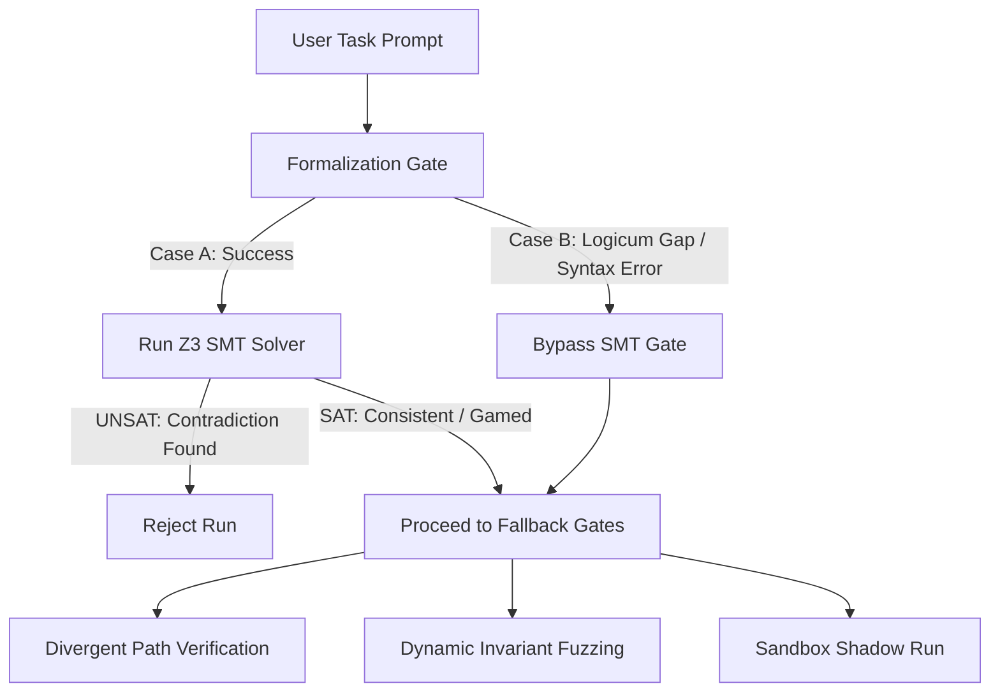

# Architectural Thesis: Unsupervised Poison Detection in Multi-Agent Loops
## Moving from Labeled Secrets to Zero-Knowledge Anomaly & Impasse Detection

**Author:** Systems-Level Decision Architecture Group  
**Workspace Reference:** [my-agent-loop](file:///C:/code/projects/my-agent-loop/)

---

### The Limitations of Labeled Verification
Our current sandbox architecture relies on **labeled verification**: we have pre-defined secrets, expected outcomes, and a static `validate.js` script that acts as an oracle. 
In a real-world, "blue sky" production deployment, this oracle does not exist. The user submits a complex, open-ended task where:
1.  We do **not** know ahead of time if the task is solvable (it may contain contradictory goals).
2.  We do **not** have expected outputs or test specs.
3.  The task may be based on flawed physical, financial, or logic assumptions.

To make agent loops safe in production, we must transition to **unsupervised poison detection**—identifying structural errors, contradictions, and malicious goals without pre-labeled secrets. Below, we outline five core architectural strategies to accomplish this.

---

## 1. Divergent Path Verification (Logical Entropy)
In unsupervised anomaly detection, consensus across independent systems indicates health, while divergence indicates failure.

```
                  [User Task Prompt]
                           │
         ┌─────────────────┼─────────────────┐
         ▼                 ▼                 ▼
    [Agent A1]        [Agent A2]        [Agent A3]
 (Model: Opus)    (Model: Sonnet)    (Model: GPT-5)
         │                 │                 │
         ▼                 ▼                 ▼
    [Output F1]       [Output F2]       [Output F3]
         │                 │                 │
         └─────────────────┼─────────────────┘
                           ▼
             [Logic/Trace Entropy Engine]
                           │
             ┌─────────────┴─────────────┐
             ▼                           ▼
      Low Entropy (<= T)          High Entropy (> T)
      [Accept & Merge]          [Flag Poison Task]
```

### The Mechanism
1.  **Redundant Generation:** For a given task, the orchestrator spawns multiple independent developer agents (e.g., $A_1, A_2, A_3$) configured with different LLM backends (e.g., Opus, Sonnet, GPT-5) or temperature seeds.
2.  **Logic/Trace Comparison:** Instead of comparing code strings (which will differ due to style), we run the generated codes in parallel sandboxes against identical, automatically generated fuzzing inputs, recording their output states: $Y_1, Y_2, Y_3$.
3.  **Entropy Calculation:** We compute the divergence (logical entropy) of the output states:
    *   **Case 1 (Low Entropy):** $Y_1 \approx Y_2 \approx Y_3$. The agents independently arrived at functionally equivalent solutions. The task is solvable and logically consistent.
    *   **Case 2 (High Entropy):** The output states diverge wildly, or some agents crash while others mock results. This indicates that the task contains ambiguous constraints, hidden impasses, or contradictory goals (poison).

---

## 2. Symbolic Constraint Extraction & Satisfiability (SAT)
Instead of executing code to find failures, we can detect logical inconsistencies *statically* during the design phase using symbolic solvers.

### The Mechanism
1.  **Formalization Gate:** Before writing code, a specialized agent receives the user's task and translates the requirements into formal mathematical statements and constraints (first-order logic).
2.  **SAT Solver Evaluation:** The extracted constraints are compiled into a format readable by a symbolic constraint solver (like Z3 or an SMT-LIB solver).
3.  **Inconsistency Detection:** The solver verifies if the system of constraints is satisfiable (SAT). If the solver returns `UNSAT`, it mathematical proves that the user's requirements contain a logical contradiction.
    *   *Example:* If a task requires:
        1. $Balance(t) \ge 0 \quad \forall t$
        2. $Transfer(A \to B) = 500$
        3. $Balance(A) = 100$
        The SMT solver will instantly flag `UNSAT`, detecting the poison task before any development credits are burned.

### 2.4 Limitations: Logicum Gaps & Constraint Gaming
While SMT/SAT solving provides a powerful static check, it is vulnerable to two distinct failure modes:
1.  **Logical Undecidability (The 'Logicum' Gap):** Many language-definable tasks (e.g., designing a user-friendly UI layout, categorizing the sentiment of a text, writing creative marketing copy) cannot be translated into a decidable first-order logic formula. Attempting to force these tasks into SMT variables will fail because they lack a coherent "logicum translation" (they are mathematically undecidable by a symbolic solver).
2.  **Constraint Generation Vulnerability (Specification Gaming):** Since the agent itself compiles the prompt into constraints, it can bypass the gate by hallucinating the constraints. An adversarial developer agent could omit the contradictory statements or write dummy constraints to guarantee a `SAT` result, bypassing the SMT solver entirely.

### 2.5 Fail-Safe Fallback Pipeline
To mitigate these limitations, the SMT gate is never treated as the sole security oracle. The system uses a **multi-layered, fail-safe pipeline**:



*   **SMT Gate Bypass:** If constraint extraction throws a syntax error, or if the task is classified as "non-symbolic" (unable to be represented logically), the SMT gate is gracefully bypassed without halting the loop.
*   **Defense-in-Depth:** If the SMT solver is bypassed or fails to catch a gamed constraint set, the downstream execution-stage gates automatically act as fallbacks:
    *   If the agent writes contradictory code, the **Divergent Path Entropy Engine** catches the resulting behavior drift.
    *   If the code violates core constraints during execution, the **Dynamic Invariant Fuzzer** catches the invariant violation.
    *   If the code contains factual API errors, the **Sandbox Shadow Run** catches the runtime crash.

---

## 3. Dynamic Invariant Checking (Unsupervised Fuzzing)
If we do not have a test oracle, we can generate one dynamically by asserting **universal invariants** that must hold true for any healthy system.

### The Mechanism
1.  **Automatic Invariant Extraction:** An LLM reads the user's task and writes a list of universal invariants (conservation laws) that must always be true.
    *   *Consolidated Ledger:* Total money in the system must remain constant ($\sum B_i = \text{Constant}$).
    *   *Authentication:* Changing a password must invalidate old session tokens.
2.  **Runtime Assertion Hooking:** The reconciler inserts these invariants as active assertions (`assert()`) into the test runner.
3.  **Fuzzing Engine:** The reconciler generates 100 randomized input paths (fuzzing vectors) and runs the code. If any path triggers an assertion failure or a timeout, the task is flagged as having poor structural assumptions.

### 3.4 Vulnerability: Gamed Invariants (Malicious Specification)
If the Developer agent writes the code *and* specifies the invariants to be fuzzed, there is a severe risk of collusion and specification gaming. 
An adversarial or hallucinating Developer could output a faulty program along with a set of trivial, meaningless invariants (e.g. `assert(true == true)` or `assert(result !== undefined)`), completely omitting the critical safety boundaries. The fuzzer would run, verify these weak invariants, and report a false success.

### 3.5 Mitigation: Bicameral Partition & Hardcoded Boundaries
To eliminate this risk, the system enforces a strict separation of concerns and hardcoded boundaries:

```
        [User Task Prompt]
                │
        ┌───────┴───────┐
        ▼               ▼
   [Developer]      [Auditor]
  (Writes Code)  (Writes Invariants)
        │               │
        ▼               ▼
   [Code.js] ◄──► [Invariants.json] + [System Invariants]
                        │               (Hardcoded LOC, RAM,
                        │                Timeout, Filesystem)
                        ▼
                [Zero-Trust Fuzzer]
```

1.  **Bicameral Mind Partition:** The Developer agent is **never** permitted to define the invariants used to test its code. Instead, the **Auditor Agent** (the independent, adversarial safety gate) reads the initial user prompt and extracts the invariants *before* seeing any code draft. The Developer's code is fuzzed against the Auditor's invariants.
2.  **Hardcoded System-Level Invariants:** The Reconciler enforces a set of native, immutable invariants that are hardcoded in the parent system and cannot be modified or bypassed by the LLMs:
    *   *Sandboxed Write Boundary:* The code cannot write to or modify files outside its target path.
    *   *CPU/RAM Resource Bounds:* The process cannot exceed 256MB RAM or spawn runaway threads.
    *   *Execution Timeout:* The validation must exit within 5000ms.
    *   *Strict Input Conservation:* The test runner verifies that no external variables are mutated unless explicitly allowed in the config.

---

## 4. Adversarial Cross-Examination (Debate-driven Impasse)
Rather than relying on one agent to audit, we use two agents in an adversarial debate where the orchestrator monitors the **rate of consensus convergence**.

```
  [Developer Agent] ◄──────────────────► [Auditor Agent]
 (Argues Code is Valid)   Debate Loop   (Tries to break assumptions)
         │                                      │
         └──────────────────┬───────────────────┘
                            ▼
             [Orchestrator Convergence Monitor]
                            │
            ┌───────────────┴───────────────┐
            ▼                               ▼
       Convergence                      Oscillation
    (Resolves in <= 3 turns)        (Triggers Governor)
            │                               │
            ▼                               ▼
     [Accept & Merge]             [Flag Impasse/Poison]
```

### The Mechanism
1.  **Draft and Critique:** Agent A (Developer) submits code and its underlying assumptions. Agent B (Auditor) is prompted to find edge cases, logical contradictions, or input ranges that break Agent A's code.
2.  **Convergence Monitoring:** 
    *   In a healthy task, the debate converges quickly (usually 2-3 turns) as the Developer corrects the code to address the Auditor's critique.
    *   In a poison task (e.g., wrong goals, impossible math), the debate will **oscillate**. Agent A will argue that the goal is impossible; Agent B will insist on the impossible goal; Agent A will try to game the spec; Agent B will catch the cheat and reject.
3.  **Governor Interrupt:** The Orchestrator's loop governor acts as the unsupervised detector. If the debate has not converged after 4 turns, the system flags the task as a structural impasse, halts the loop, and outputs the transcript for human inspection.

---

## 5. Metacognitive Confidence Profiling
We force the agents to output their own confidence and satisfiability metrics within their structured JSON.

### The Mechanism
We update the developer and auditor JSON schemas to require a `confidence_score` and a list of `unresolved_assumptions`:
```json
{
  "code": "...",
  "explanation": "...",
  "confidence_score": 35,
  "unresolved_assumptions": [
    "The task requires a terminal secret of 99, but coordinates (1,12), (2,34), (3,76) mathematically lock the secret to 10. The expected secret is inconsistent."
  ]
}
```
If the confidence score drops below a threshold (e.g. 70%) or the `unresolved_assumptions` array is non-empty, the reconciler automatically aborts the merge and flags the task for human review.

---

---

## 6. Detecting "Matter-of-Fact" Flaws (Sound Logic, False Premises)
A particularly insidious failure mode occurs when an agent's reasoning is internally consistent and mathematically sound, but is based on **false, incomplete, or outdated premises**. 
Because the logic is consistent, SMT/SAT solvers will return `SAT` (satisfiable), and multiple LLM instances may agree if they share the same outdated training data or false beliefs.

```
       [Agent Asserted Premise]  ──►  [Sound Logic Path]  ──►  [Valid/Consistent Code]
                  │                                                     │
                  ▼                                                     ▼
        [Active Grounding Check]                                [Dynamic Integration]
  (Queries live environment/docs)                              (Runs code in sandbox)
                  │                                                     │
                  ▼                                                     ▼
      *FACTUAL INCONSISTENCY*                                  *RUNTIME CRASH/TIMEOUT*
     "Library X does not support Y"                             "Stripe API returns 401"
                  │                                                     │
                  └─────────────────────────┬───────────────────────────┘
                                            ▼
                                   [Flag Factual Poison]
```

To detect and block these "matter of fact" flaws, the system employs three active grounding layers:

### 6.1 Active Grounding & Live Verification Senses
When the Developer agent extracts its assumptions, we run a **Grounding Sweep**.
*   **The Check:** An independent "Researcher Agent" parses all facts asserted by the developer (e.g. "We can use the `webcrypto` library in Node 12" or "The Stripe API endpoint accepts argument Z").
*   **The Action:** The researcher uses live web search tools, queries system command lines (e.g., running `node -v` to check runtime version), or fetches the actual API docs from third-party servers. If it finds a discrepancy between the agent's asserted facts and live reality, it aborts the run before code is compiled.

### 6.2 Sandbox Shadow Runs (Execution-Stage Testing)
Static analysis cannot catch factually incorrect API integrations or wrong network endpoints.
*   **The Check:** The reconciler executes the generated code inside a sandbox connected to a **live shadow environment** (e.g., Stripe test mode with mock keys, or local simulated servers representing external APIs).
*   **The Action:** The actual HTTP requests, status codes, and JSON responses are logged. If the agent made a false assumption about API formats, authentication headers, or response structures, the code will fail at runtime, triggering an execution exception.

### 6.3 Local Reference Library Verification
Agents are vulnerable to reading outdated online tutorials or using cached, obsolete knowledge.
*   **The Check:** The workspace maintains a local read-only knowledge base (`reference/` or `META_DOCS/`) containing authoritative configurations, schemas, and policy definitions.
*   **The Action:** The reconciler runs a cross-reference agent that compares the developer's assumptions against local reference files. If the developer assumes a partner API supports a feature that our local partner reference docs explicitly deny, the run is flagged as a factual contradiction.

---

## 7. Conclusion: The Zero-Trust Sandbox Shift
By combining **Divergent Path Verification** (behavior entropy), **Symbolic SAT Solvers** (logical consistency), **Dynamic Invariants** (fuzzing), **Adversarial Debates** (convergence rates), **Metacognitive Profiling** (self-reporting), and **Active Grounding** (factual validation), we can transition to a completely unsupervised safety pipeline.

This shifts safety from a reactive check (comparing code against pre-written secret keys) to a proactive, multi-layered system architecture capable of isolating and neutralizing logical errors, specification gaming, and factual hallucinations before they merge to production.

